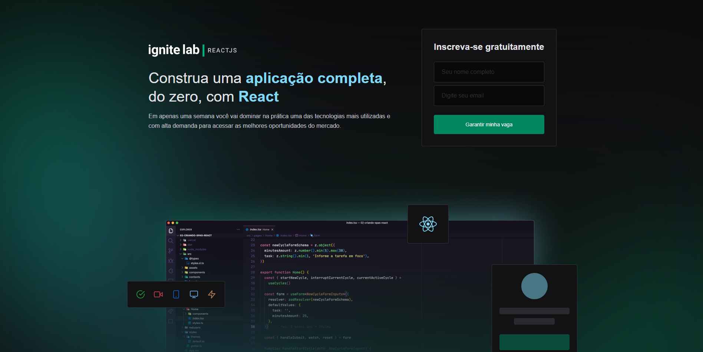

<h2 align="center">
   Ignite Lab 
</h2>

  <a href="#-projeto">Projeto</a>&nbsp;&nbsp;&nbsp;|&nbsp;&nbsp;&nbsp;
  <a href="#-tecnologias">Tecnologias</a>&nbsp;&nbsp;&nbsp;|&nbsp;&nbsp;&nbsp;
  <a href="#-Layout">Layout</a>&nbsp;&nbsp;&nbsp;|&nbsp;&nbsp;&nbsp;
  <a href="#-licença">Licença</a>

## 💻 Projeto

Nesse desafio, foi desenvolvido uma plataforma de eventos 

### 📸 Imagens

**Evento selecionado**

## 🚀 Tecnologias

Esse projeto foi desenvolvido com as seguintes tecnologias:

-   [VueJs](https://vuejs.org/)
-   [TypeScript](https://www.typescriptlang.org/pt/)
-   [Vite](https://vitejs.dev/)

## 📝 Licença

Esse projeto está sob a licença MIT. Veja o arquivo [LICENSE](LICENSE) para mais detalhes.
